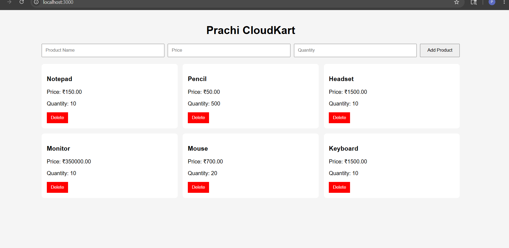
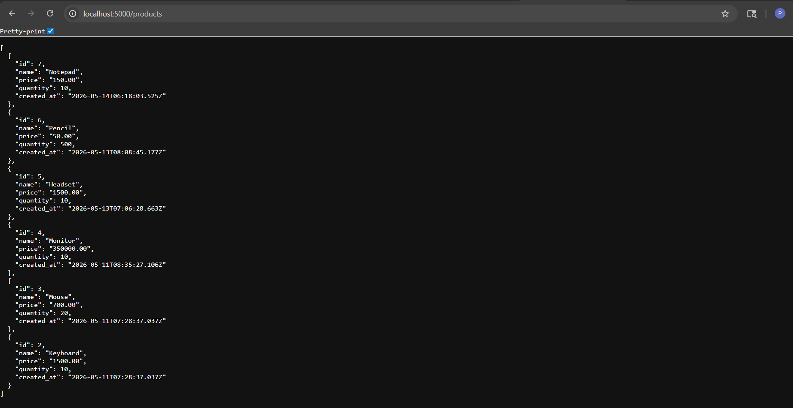
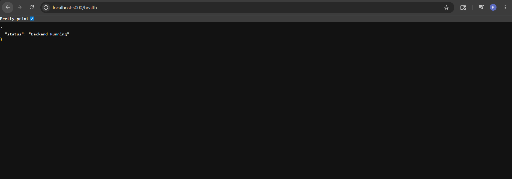

# CloudKart - 3 Tier Application Deployment

## Project Overview

CloudKart is a full-stack 3-tier application built using:

* React.js (Frontend)
* Node.js + Express.js (Backend)
* PostgreSQL (Database)
* Docker (Containerization)
* Kubernetes (Production Deployment)
* GitHub Actions (CI/CD)
* DockerHub (Container Registry)

This project demonstrates:

* Local application development
* Docker image creation
* Kubernetes deployment
* CI/CD automation
* Frontend-to-backend communication
* Backend-to-database communication

---

# Architecture

```text
Users
   |
Frontend (React)
   |
Backend (Node.js + Express)
   |
PostgreSQL Database
```

---

# Project Structure

```text
GithubAction-CloudKart-Project/

├── Frontend/
├── Backend/
├── database/
├── k8s/
├── .github/workflows/
└── README.md
```

---

# Run Application Locally

## Clone Repository

```bash
git clone <repository-url>
cd GithubAction-CloudKart-Project
```

---

## Backend Setup

```bash
cd Backend
npm install
node server.js
```

Create:

```text
Backend/.env
```

Backend runs on:

```text
http://localhost:5000
```

---

## Frontend Setup

```bash
cd Frontend
npm install
npm start
```

Frontend runs on:

```text
http://localhost:3000
```

---

## PostgreSQL Setup

Database initialization file:

```text
database/init.sql
```

Create database locally in PostgreSQL before running backend.

---

# Check Application Using Docker Compose

Docker Compose is used only for local testing and verification.

Start application:

```bash
docker compose up -d
```

Check running containers:

```bash
docker ps
```

Check logs:

```bash
docker compose logs
```

Stop application:

```bash
docker compose down
```

---

# Docker Files

```text
Frontend/Dockerfile
Backend/Dockerfile
docker-compose.yml
```

Build frontend image:

```bash
docker build -t prachi-frontend ./Frontend
```

Build backend image:

```bash
docker build -t prachi-backend ./Backend
```

---

# Kubernetes Deployment (Production)

In production, the application is deployed on a Kubernetes cluster.

Kubernetes provides:

* Auto healing
* Scaling
* High availability
* Load balancing
* Rolling updates

---

# Kubernetes Files

```text
k8s/namespace.yaml
k8s/frontend-deployment.yaml
k8s/frontend-service.yaml
k8s/backend-deployment.yaml
k8s/backend-service.yaml
k8s/postgres-deployment.yaml
k8s/postgres-service.yaml
```

---

# Deploy to Kubernetes

Create namespace:

```bash
kubectl apply -f k8s/namespace.yaml
```

Deploy database:

```bash
kubectl apply -f k8s/postgres-deployment.yaml
kubectl apply -f k8s/postgres-service.yaml
```

Deploy backend:

```bash
kubectl apply -f k8s/backend-deployment.yaml
kubectl apply -f k8s/backend-service.yaml
```

Deploy frontend:

```bash
kubectl apply -f k8s/frontend-deployment.yaml
kubectl apply -f k8s/frontend-service.yaml
```

---

# Verify Deployment

Check pods:

```bash
kubectl get pods -n cloudkart
```

Check services:

```bash
kubectl get svc -n cloudkart
```

Check deployments:

```bash
kubectl get deployments -n cloudkart
```

---

# CI/CD Pipeline

Workflow file:

```text
.github/workflows/cicd.yml
```

Pipeline includes:

* Code checkout
* Docker image build
* DockerHub login
* Docker image push

---

# GitHub Secrets

| Secret Name     | Description              |
| --------------- | ------------------------ |
| DOCKER_USERNAME | DockerHub Username       |
| DOCKER_PASSWORD | DockerHub Token/Password |

---

# Common Commands

Check Docker containers:

```bash
docker ps
```

Check Kubernetes pods:

```bash
kubectl get pods
```

Check logs:

```bash
kubectl logs <pod-name>
```

Restart deployment:

```bash
kubectl rollout restart deployment <deployment-name>
```

---

# Future Improvements

* AWS EKS
* Terraform
* ArgoCD
* Prometheus & Grafana
* NGINX Ingress
* SSL/HTTPS

---

# DevOps Concepts Covered

* Docker
* Kubernetes
* CI/CD
* DockerHub
* GitHub Actions
* PostgreSQL
* Persistent Storage
* Container Networking
* 3-Tier Architecture

---

# Author

Prachi Patil

GitHub Repository:

https://github.com/PrachiVpatil96/GithubAction-CloudKart-Project




